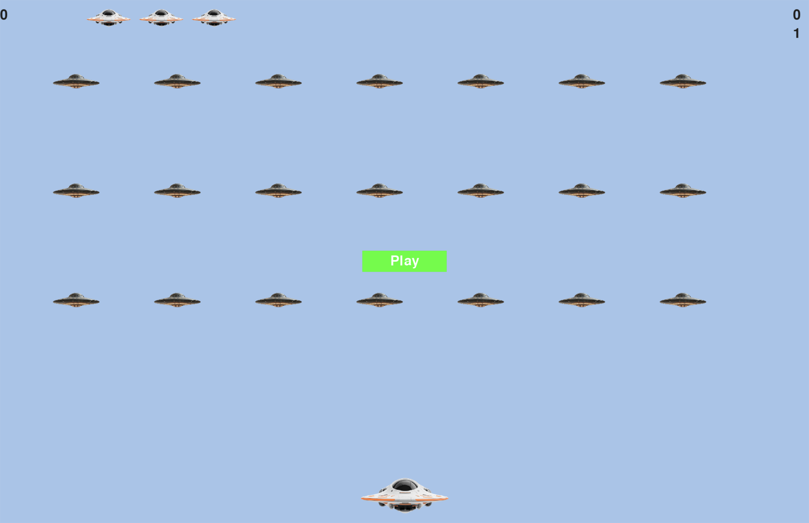

# 🚀 Alien Invasion (Pygame)

Alien Invasion is a 2D arcade-style game built with **Python** and **Pygame**.  
The player controls a spaceship, shoots waves of aliens, and earns points while progressing through increasingly difficult levels.

This project was created for learning purposes to practice Python, object-oriented programming, and game development fundamentals.

---

## 🎮 Gameplay

- Control a spaceship using the keyboard
- Shoot aliens and clear enemy waves
- Increasing difficulty with each level
- Life system
- Score, high score, and level tracking
- Game Over screen with a Play button

---

## 🛠 Technologies Used

- **Python 3**
- **Pygame**
- Object-Oriented Programming (OOP)

---

## ⌨️ Controls

- `Left / Right Arrow` — move the ship
- `Space` — shoot
- `Q` — quit the game
- `Play` — start a new game

---

## 📊 Implemented Features

- Collision detection (bullets ↔ aliens, ship ↔ aliens)
- Progressive difficulty scaling
- Bullet limit system
- On-screen display of:
  - current score
  - high score
  - current level
  - remaining lives (ship icons)

---

## 📷 Screenshot

